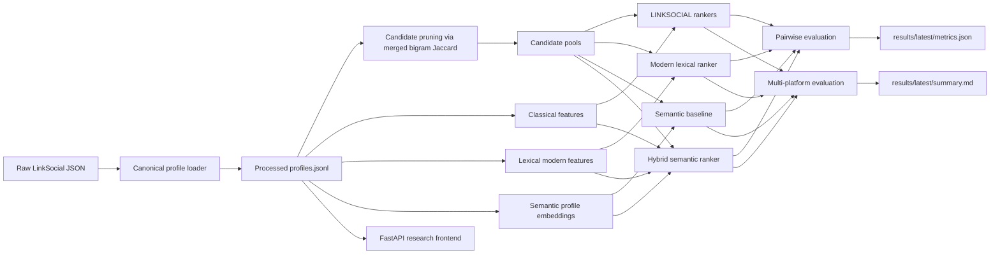

# LINKSOCIAL Final-Year Project

Research-focused implementation of LINKSOCIAL for cross-platform user identity linkage on the public LinkSocial dataset, extended with stronger semantic and hybrid baselines plus a lightweight frontend for demo and analysis.

## What This Project Includes

- reproduction-oriented LINKSOCIAL pipeline
- stronger profile-only comparison models
- GPU-backed semantic profile embeddings with caching
- pairwise and three-platform evaluation
- minimal research frontend for interactive profile linking

Core question:

> Using only public profile metadata from Google+, Instagram, and Twitter, how much can we improve on the original 2018 LINKSOCIAL pipeline while staying fair to the available dataset?

## Current Architecture



## Model Suite

| Model | Type | Inputs | Role |
| --- | --- | --- | --- |
| `baseline` | unsupervised | username, full name, bio | simple additive similarity baseline |
| `semantic_cosine` | unsupervised | semantic profile embeddings | semantic nearest-neighbor baseline |
| `linksocial_sgd` | supervised | classical LINKSOCIAL features | weighted ranking reproduction |
| `linksocial_logreg` | supervised | classical LINKSOCIAL features | linear comparison model |
| `linksocial_rf` | supervised | classical LINKSOCIAL features | tree-based paper-style comparison |
| `lexical_modern_gbdt` | supervised | classical + lexical modern features | stronger non-neural modern baseline |
| `semantic_hybrid_gbdt` | supervised | classical + lexical + semantic features | strongest profile-only model in current repo |

## Repo Layout

- `src/linksocial_final_year/data.py`: raw dataset parsing and canonical loading
- `src/linksocial_final_year/features.py`: classical, lexical, and semantic-compatible feature construction
- `src/linksocial_final_year/evaluation.py`: training, scoring, pairwise, and multi-platform evaluation
- `src/linksocial_final_year/webapp.py`: FastAPI app and demo service
- `src/linksocial_final_year/web/`: minimal frontend assets
- `tests/`: pipeline and web app tests

## Setup

Install everything with `uv`:

```bash
uv sync --dev
```

Python requirement:

- `>=3.12`

## Dataset Preparation

Expected raw dataset location:

```text
data/raw/Dataset-LinkSocial
```

Prepare the canonical processed file:

```bash
uv run linksocial prepare-data
```

This writes:

- `data/processed/profiles.jsonl`

## Run Experiments

Recommended command used for the current evaluated results:

```bash
uv run linksocial run-experiments \
  --max-candidates 40 \
  --min-candidates 20 \
  --cluster-ratio 0.005 \
  --semantic-model-name BAAI/bge-small-en-v1.5 \
  --semantic-batch-size 128
```

Outputs:

- `results/latest/metrics.json`
- `results/latest/summary.md`
- `data/processed/semantic_cache/*.npz`

Notes:

- semantic embeddings are cached after the first full run
- the default experimental story is profile-only, not graph-based or multimodal

## Run The Frontend

Two equivalent ways:

```bash
uv run linksocial serve-web --host 127.0.0.1 --port 8000
```

or:

```bash
uv run linksocial-web
```

Then open:

```text
http://127.0.0.1:8000
```

The frontend is intentionally minimal and research-oriented:

- left: source profile search
- center: candidate linkage graph
- right: evidence inspector with feature and model scores
- bottom: experiment result tables

On first real boot, the app may train or load cached demo pair models under:

- `data/processed/demo_models/`

After that, reopening the UI is much faster.

## Current Results

These are the current evaluated results from the environment used in this repo.

### Pairwise Results

| Task | Baseline | Semantic cosine | LINKSOCIAL SGD | LINKSOCIAL LogReg | LINKSOCIAL RF | Lexical modern GBDT | Semantic hybrid GBDT |
| --- | ---: | ---: | ---: | ---: | ---: | ---: | ---: |
| Google+ -> Instagram | 0.5400 | 0.8149 | 0.8152 | 0.8137 | 0.8449 | 0.8775 | 0.8820 |
| Google+ -> Twitter | 0.5489 | 0.8050 | 0.7474 | 0.7478 | 0.8048 | 0.8424 | 0.8496 |
| Instagram -> Twitter | 0.7896 | 0.8864 | 0.9011 | 0.9001 | 0.9146 | 0.9264 | 0.9251 |

### Multi-Platform Results

| Model | Google+ anchor | Instagram anchor | Twitter anchor | Mean |
| --- | ---: | ---: | ---: | ---: |
| Baseline | 0.4489 | 0.6593 | 0.7243 | 0.6109 |
| Semantic cosine | 0.7240 | 0.7873 | 0.8051 | 0.7721 |
| LINKSOCIAL SGD | 0.6936 | 0.7718 | 0.7518 | 0.7391 |
| LINKSOCIAL LogReg | 0.7007 | 0.7725 | 0.7563 | 0.7432 |
| LINKSOCIAL RF | 0.8103 | 0.8523 | 0.8426 | 0.8351 |
| Lexical modern GBDT | 0.8187 | 0.8604 | 0.8533 | 0.8441 |
| Semantic hybrid GBDT | 0.8313 | 0.8668 | 0.8633 | 0.8538 |

## Practical Takeaways

- the original LINKSOCIAL feature family is still strong, especially `linksocial_rf`
- semantic-only ranking is already competitive on this dataset
- the best current approach in this repo is the hybrid semantic model
- the strongest profile-only story here is not replacing LINKSOCIAL, but extending it

## Frontend Product Direction

The frontend is intentionally not a flashy dashboard. The current UI is meant to feel like a real analyst tool:

- compact top bar instead of a landing-page hero
- restrained monochrome surface with one accent color
- dense but readable data presentation
- candidate graph as a working aid, not decoration
- evidence inspector focused on scores and signals

## Tests

Run the test suite with:

```bash
uv run pytest
```

Current test coverage includes:

- dataset loading and canonicalization
- experiment pipeline smoke coverage
- web app endpoint smoke coverage

## Reproduction Notes

- the paper uses a 60/40 train-test split; this repo follows that default
- the public dataset exposes profile JSON and identity grouping, but not the full multimodal signals described in later UIL work
- image similarity from the original paper is not executable here because the public dataset does not provide a complete image-feature setup
- the semantic extension is profile-only to keep the comparison fair on the available data

## Recent Research Context

The repo already includes stronger profile-only baselines, but recent UIL work has moved further in several directions:

- deep semantic modeling over richer user text
- graph-aware linkage over follower or interaction networks
- multimodal linkage using images and posts
- LLM-assisted multi-view reasoning over heterogeneous signals

Representative sources referenced during implementation:

- Senette et al. 2024 survey: https://arxiv.org/abs/2409.08966
- StyleLink (ICWSM 2025): https://dmas.lab.mcgill.ca/fung/pub/XF25icwsm.pdf
- UIL-HC-MV (ACML 2025): https://openreview.net/pdf/5d7fba2a7e864abde843889768ee70bd3408b110.pdf
- MT-Link (2025): https://arxiv.org/abs/2504.01979
- DegUIL (2023): https://arxiv.org/abs/2308.05322

## What Is Still Out Of Scope For This Dataset

Not realistically implementable on the public LinkSocial release without collecting new data:

- follower/friend graph alignment
- post-level stylometry
- multimodal post or profile-image fusion
- mobility or temporal co-occurrence linkage
- LLM-guided graph-and-attribute reasoning

## Good Next Steps

1. Upgrade the semantic encoder or add a cross-encoder reranker for top-k candidates.
2. Add stylometric features if post text becomes available.
3. Add CLIP or BLIP-based image fusion if richer media is collected.
4. Add a graph branch if follower or interaction data is obtained.
5. Add model explainability summaries in the frontend for candidate-level reasoning.
