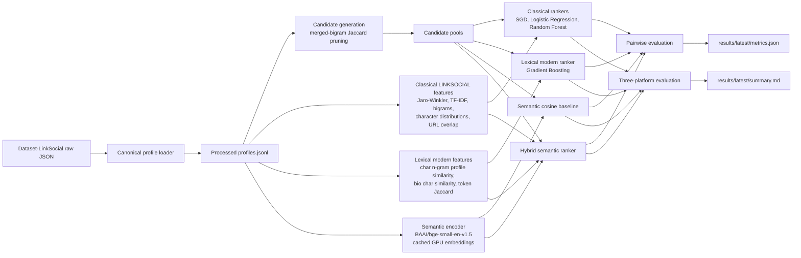

# LINKSOCIAL Final-Year Project

Research-focused implementation of the LINKSOCIAL user identity linkage pipeline on the public LinkSocial dataset, extended with newer semantic baselines and a stronger hybrid ranker.

## Project Scope

This repo is built around one practical question:

> Given only public profile metadata from Google+, Instagram, and Twitter, how far can we push identity linkage beyond the original 2018 LINKSOCIAL feature-engineering pipeline?

To answer that, the project now includes:

- a reproduction-oriented LINKSOCIAL pipeline
- several stronger comparison models
- cached semantic profile embeddings running on GPU
- pairwise and multi-platform evaluation
- documented research context and architecture

## Architecture



## Model Suite

| Model | Type | Input family | Purpose |
| --- | --- | --- | --- |
| `baseline` | unsupervised | username, full name, bio | Simple additive similarity baseline |
| `semantic_cosine` | unsupervised | semantic profile embedding | Modern semantic nearest-neighbor baseline |
| `linksocial_sgd` | supervised | classical LINKSOCIAL features | Reproduction of weighted ranking idea |
| `linksocial_logreg` | supervised | classical LINKSOCIAL features | Strong linear comparator |
| `linksocial_rf` | supervised | classical LINKSOCIAL features | Tree-based comparator close to the paper |
| `lexical_modern_gbdt` | supervised | classical + richer lexical features | Strong non-neural modern profile baseline |
| `semantic_hybrid_gbdt` | supervised | classical + lexical + semantic | Strongest research-oriented profile-only model |

## What the code does

- Parses the public LinkSocial dataset into a canonical schema.
- Reproduces the core LINKSOCIAL ideas:
  - Jaro-Winkler similarity
  - TF-IDF bio similarity
  - bigram overlaps
  - character-distribution similarity
  - Jaccard-based candidate pruning
- Adds newer profile-linkage baselines:
  - semantic cosine over `BAAI/bge-small-en-v1.5`
  - logistic regression on classical features
  - gradient-boosted lexical-modern model
  - gradient-boosted semantic-hybrid model
- Evaluates:
  - pairwise linkage across `google_plus`, `instagram`, and `twitter`
  - three-platform linkage across all supported models

## Setup

```bash
uv sync --dev
```

## Run The Research Frontend

```bash
uv run linksocial serve-web --host 127.0.0.1 --port 8000
```

Then open `http://127.0.0.1:8000`.

The frontend is designed as a research studio rather than a dashboard:

- left panel: profile search and source selection
- center panel: orbit-style linkage graph
- right panel: evidence inspector with model scores and top features
- lower panels: pairwise and multi-platform result tables

On first real boot, the app loads cached semantic embeddings and builds or loads demo model artifacts from `data/processed/demo_models/`. After that, the UI is much faster to reopen.

## Data Preparation

The dataset should exist at `data/raw/Dataset-LinkSocial`.

Prepare the canonical processed file:

```bash
uv run linksocial prepare-data
```

This writes `data/processed/profiles.jsonl`.

## Run Experiments

```bash
uv run linksocial run-experiments \
  --max-candidates 40 \
  --min-candidates 20 \
  --cluster-ratio 0.005 \
  --semantic-model-name BAAI/bge-small-en-v1.5 \
  --semantic-batch-size 128
```

Optional knobs:

```bash
uv run linksocial run-experiments \
  --max-candidates 150 \
  --cluster-ratio 0.02 \
  --seed 42 \
  --semantic-model-name BAAI/bge-small-en-v1.5
```

Results are written under `results/latest/`.

Semantic embeddings are cached at `data/processed/semantic_cache/BAAI__bge_small_en_v1_5.npz` so repeated runs do not re-encode all profiles.

## Results From This Environment

Run used:

```bash
uv run linksocial run-experiments \
  --max-candidates 40 \
  --min-candidates 20 \
  --cluster-ratio 0.005 \
  --semantic-batch-size 128
```

### Pairwise Results

| Task | Baseline | Semantic cosine | LINKSOCIAL SGD | LINKSOCIAL LogReg | LINKSOCIAL RF | Lexical modern GBDT | Semantic hybrid GBDT |
| --- | ---: | ---: | ---: | ---: | ---: | ---: | ---: |
| Google+ -> Instagram | 0.5400 | 0.8149 | 0.8152 | 0.8137 | 0.8449 | 0.8775 | 0.8820 |
| Google+ -> Twitter | 0.5489 | 0.8050 | 0.7474 | 0.7478 | 0.8048 | 0.8424 | 0.8496 |
| Instagram -> Twitter | 0.7896 | 0.8864 | 0.9011 | 0.9001 | 0.9146 | 0.9264 | 0.9251 |

### Multi-Platform Results

| Model | Google+ anchor | Instagram anchor | Twitter anchor | Mean |
| --- | ---: | ---: | ---: | ---: |
| Baseline | 0.4489 | 0.6593 | 0.7243 | 0.6109 |
| Semantic cosine | 0.7240 | 0.7873 | 0.8051 | 0.7721 |
| LINKSOCIAL SGD | 0.6936 | 0.7718 | 0.7518 | 0.7391 |
| LINKSOCIAL LogReg | 0.7007 | 0.7725 | 0.7563 | 0.7432 |
| LINKSOCIAL RF | 0.8103 | 0.8523 | 0.8426 | 0.8351 |
| Lexical modern GBDT | 0.8187 | 0.8604 | 0.8533 | 0.8441 |
| Semantic hybrid GBDT | 0.8313 | 0.8668 | 0.8633 | 0.8538 |

### Interpretation

- The original LINKSOCIAL family remains strong, especially `linksocial_rf`.
- A pure semantic encoder is already competitive, especially on multi-platform linkage.
- The best overall model in this dataset setting is the profile-only semantic hybrid ranker.
- This suggests the current dataset benefits most from combining:
  - classical profile-matching heuristics
  - richer lexical overlap signals
  - semantic profile representations

## Tests

```bash
uv run pytest
```

## Notes on Reproduction

- The paper uses a 60/40 train-test split. This repo follows that default.
- The public dataset contains profile JSON and ground-truth group structure, but not the original image embeddings used in the paper.
- Image similarity is therefore excluded from the executable reproduction.
- Candidate pruning is implemented using the paper’s merged-bigram Jaccard idea, with configurable cluster size.
- The semantic extension is intentionally profile-only so the comparison remains fair on the available dataset.

## Expected Outputs

- `results/latest/metrics.json`
- `results/latest/summary.md`
- `data/processed/semantic_cache/*.npz`

## Recent UIL Advancements As Of April 8, 2026

The 2024 survey by Senette, Siino, and Tesconi argues that recent progress is increasingly driven by deep architectures, but also emphasizes that benchmark scarcity and restricted platform APIs remain the main bottlenecks for fair comparison. Source: https://arxiv.org/abs/2409.08966

Recent representative directions:

- `StyleLink` (ICWSM 2025): brings stylometric representations into a GNN-based UIL pipeline, combining writing-style signals with social structure. This is relevant if you extend this project from profile metadata to post text and interaction graphs. Source: https://dmas.lab.mcgill.ca/fung/pub/XF25icwsm.pdf
- `UIL-HC-MV` (ACML 2025): uses multi-view attribute and structure fusion, then adds LLM-derived high-order themes and BERT fine-tuning to reduce cross-network heterogeneity. Source: https://openreview.net/pdf/5d7fba2a7e864abde843889768ee70bd3408b110.pdf
- `MT-Link` (arXiv 2025): uses a correlation-attention masked transformer to learn spatio-temporal co-occurrence for mobility-based UIL. Source: https://arxiv.org/abs/2504.01979
- `DegUIL` (2023): focuses on long-tailed graph UIL and degree imbalance, which remains a core issue when moving from profile matching to graph alignment. Source: https://arxiv.org/abs/2308.05322

## What We Implemented Versus What The Latest Papers Need

Implemented now:

- profile attributes
- lexical similarity
- semantic profile embeddings
- supervised reranking over candidate pools

Not implementable on the current public LinkSocial dataset without new data collection:

- social graph modeling
- stylometric post-level modeling
- multimodal image-plus-post fusion
- spatio-temporal mobility linkage
- LLM-guided multi-view graph reasoning

## Next Research Upgrades For This Repo

Given the current codebase and your dual RTX 3060 12 GB GPUs, the most logical next upgrades are:

1. Replace `BAAI/bge-small-en-v1.5` with a larger semantic encoder or a cross-encoder reranker for top-k candidate reranking.
2. Add stylometric features if you can collect user posts or captions, aligning this repo with the StyleLink direction.
3. Add CLIP or BLIP-based profile/image fusion if profile pictures or post images become available.
4. Add a heterogeneous graph branch if follower/friend or interaction data is collected, then compare against DegUIL-style graph-aware methods.
5. Add an LLM-assisted explanation or theme-extraction stage once richer user text is available, closer to UIL-HC-MV.

## Research-Backed Conclusion

On this dataset, the strongest practical direction is not abandoning LINKSOCIAL, but extending it. The best results came from a hybrid stack that keeps the paper’s profile-engineering intuition and augments it with stronger lexical and semantic representations. That is the right research story for this codebase today: a careful classical reproduction plus a logically stronger, dataset-compatible modern comparison.
